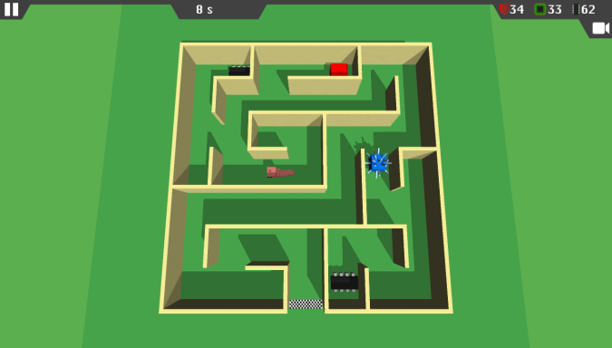
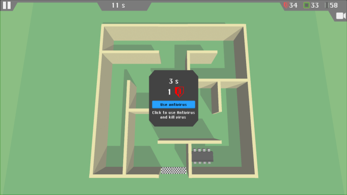
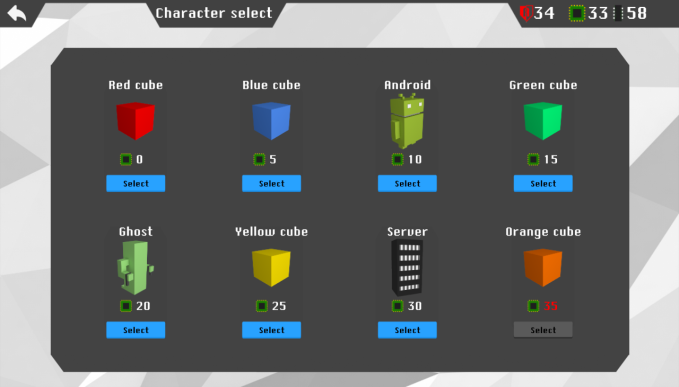
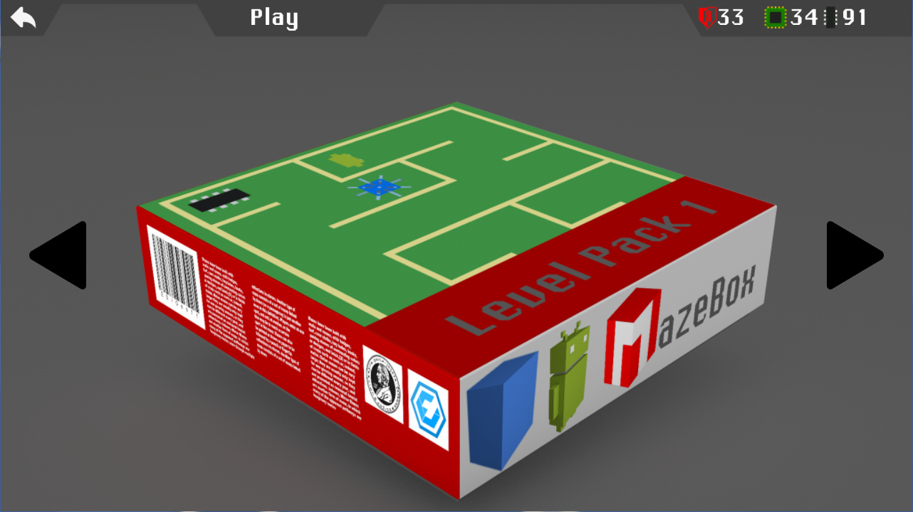
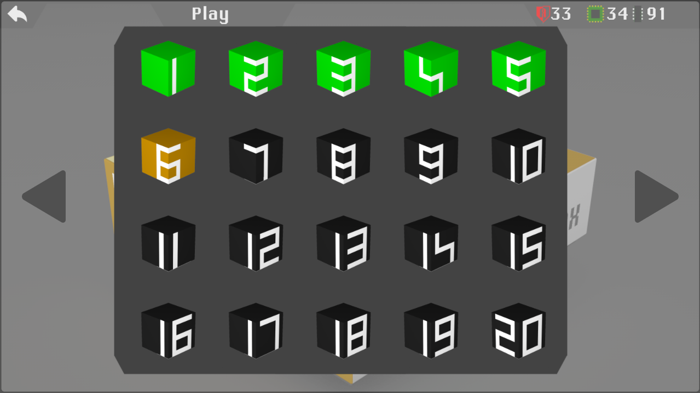

**Authors:** Juraj Marcin, Peter Tóth

**Language:** Unity3D, C#

As you can guess from its name, MazeBox is simple logic game in which the main goal is to find the way out of the maze. Currently there are 2 level packs with 20 levels each. The maze gets bigger after each 5 levels.

Viruses are going to make it harder. If you run across some, you can use Antivirus, or have to start from the beginning.

You can choose from 8 playable characters (cubes, ghost, android, server rack) which are unlockable by completing levels.

## Game controls

- **Movement:** `WASD`, `arrows`
- **Changing view:** `Q`
- **Pause, Exit:** `Escape`
- **Console:** `Ctrl` + `Alt` + `C`

## Screenshots

*Level pack*

*Levels*
